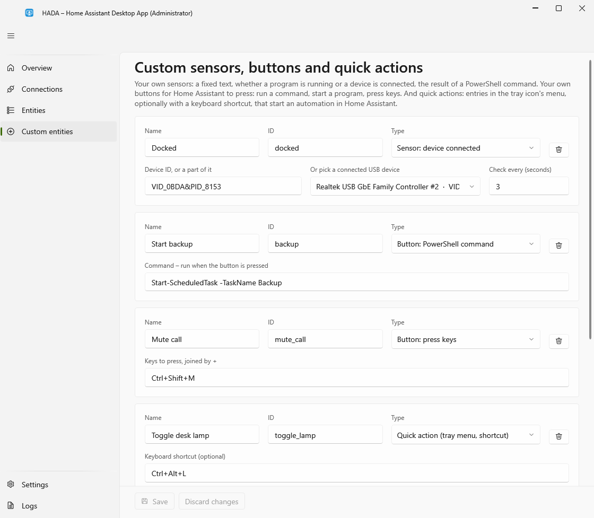

# Custom sensors, buttons and quick actions



On the **Custom entities** page you define your own sensors:

| Type | Becomes | What you enter |
|---|---|---|
| **Fixed text** | sensor | A value that stays the same until you change it, e.g. the room the computer is in |
| **Program is running** | binary sensor | A process name such as `chrome`. On while at least one such process runs; the count is in the `instances` attribute |
| **PowerShell command** | sensor | A command; whatever it prints becomes the value. Example: `[math]::Round((Get-PSDrive C).Free / 1GB)` with the unit `GB` |
| **Device is connected** | binary sensor | A part of a device's ID, such as `VID_0BDA&PID_8153`, or pick one of the connected USB devices from the list. On while such a device is connected: a USB-C dock, a drive, a headset |

And your own buttons, which Home Assistant can press from a dashboard or an automation:

| Type | What you enter | Where it runs |
|---|---|---|
| **Button: PowerShell command** | A command, e.g. `Start-ScheduledTask -TaskName Backup` | In the service, so as SYSTEM when installed, without a desktop. It may take up to 10 minutes; pressing the button again meanwhile is ignored |
| **Button: start a program** | A program with its arguments, a document, or an address: `"C:\Program Files\App\app.exe" --option`, `notepad`, `https://example.com` | On the desktop of the signed-in user, with that user's rights, so the tray app must be running. Put a path that contains spaces in quotes |

| **Button: press keys** | A key combination, e.g. `Ctrl+Shift+M`, `F11` or `MediaNext` | On the desktop of the signed-in user, as if typed; the program that has the focus gets the keys |

What a button does is fixed in settings. Home Assistant can only press it; it cannot send a command of its own.

Keys are joined by `+`: any of `Ctrl`, `Alt`, `Shift` and `Win`, then at most one key: a letter, a digit, `F1` to `F24`, or one of `Enter`, `Tab`, `Space`, `Esc`, `Backspace`, `Delete`, `Insert`, `Home`, `End`, `PageUp`, `PageDown`, `Up`, `Down`, `Left`, `Right`, `PrintScreen`, `Pause`, `VolumeUp`, `VolumeDown`, `VolumeMute`, `MediaPlayPause`, `MediaNext`, `MediaPrevious`, `MediaStop`. Windows keeps its own secure shortcuts, such as `Ctrl+Alt+Del` and `Win+L`, out of reach, and ignores injected keys while a program running as administrator has the focus.

## Quick actions

*New in 1.1.0, a pre-release.*

A quick action goes the other way: it lets you start something in Home Assistant from the computer. Add one with the type **Quick action** and give it a name; a keyboard shortcut is optional, and must include `Ctrl`, `Alt` or `Win`.

- It appears in the menu of the HADA tray icon, with its shortcut next to it.
- The shortcut works whichever program has the focus. If another program already uses it, the menu entry still works, and the tray app's log says so.
- In Home Assistant it appears as a **trigger of the device**: in the automation editor choose **Device**, the computer, and the quick action's name.

By itself a quick action does nothing; an automation says what it does:

```yaml
automation:
  - alias: Toggle the desk lamp from the laptop
    triggers:
      - trigger: mqtt
        topic: hada/laptop/event/quick_action
        payload: toggle_lamp
    actions:
      - action: light.toggle
        target:
          entity_id: light.desk_lamp
```

The payload is the quick action's ID. With several users signed in, only the quick actions of the user at the computer reach Home Assistant.

## Details

- The **ID** is the entity ID. Leave it empty to derive it from the name (`Gra włączona` → `gra_wlaczona`).
- Set a **unit** only for numbers. Home Assistant then treats the sensor as a measurement and draws a graph.
- A program is looked for, and a command is run, every *n* seconds: at least 2, by default 30.
- PowerShell commands are run by the service with Windows PowerShell 5.1, so as SYSTEM when installed. They cannot see your desktop or the files and settings of your user account. A command must finish within 30 seconds; if it fails or prints nothing, the sensor keeps its last value and the reason appears on the **Logs** page.
- A device is matched against the instance IDs of all connected devices, ignoring case, so any part that identifies it works; Device Manager shows the full ID under **Details → Device instance path**. The check is cheap, so an interval of a few seconds is fine.
- Removing a custom sensor or button also removes it from Home Assistant.

## Example: is the laptop docked?

A monitor on a smart plug should be powered only while the laptop sits in its USB-C dock with the screen on. Whether the laptop is charging does not say that, since a plain charger charges it too. Neither does `external_display`: once the plug is off, the monitor has no power and Windows no longer sees it. The dock itself does: its own devices, such as its network adapter, are there whenever the cable is plugged in.

1. With the laptop docked, add a custom sensor of the type **Device is connected**, pick a device that belongs to the dock from the list, name it *Docked*, and set it to check every 3 seconds.
2. In Home Assistant, let the plug follow both sensors:

```yaml
automation:
  - alias: Monitor power follows the docked laptop
    triggers:
      - trigger: state
        entity_id:
          - binary_sensor.laptop_docked
          - binary_sensor.laptop_display
    actions:
      - action: >-
          switch.turn_{{ 'on' if is_state('binary_sensor.laptop_docked', 'on')
          and is_state('binary_sensor.laptop_display', 'on') else 'off' }}
        target:
          entity_id: switch.monitor_plug
```

While the laptop is asleep or off, both sensors are *unavailable*, which also turns the plug off.
