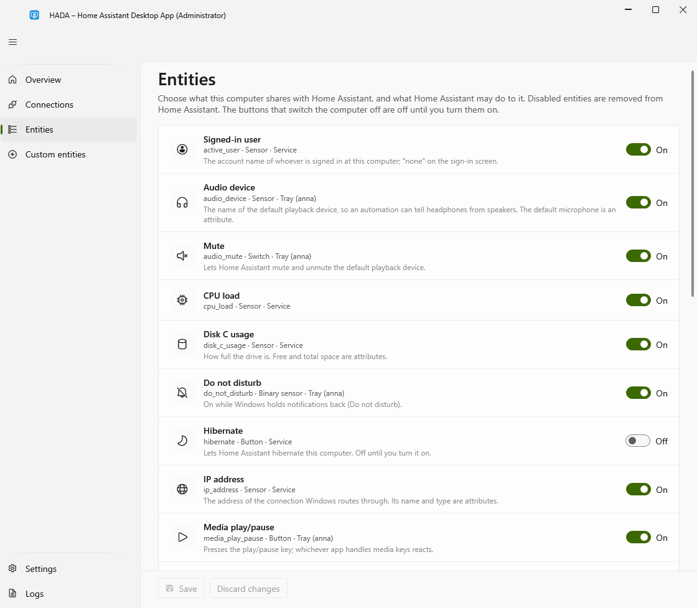

# First setup

After [installing](installation.md), HADA is running but not yet connected to anything. This page connects it to Home Assistant through MQTT, the recommended way. Without a broker, use the [WebSocket engine](../home-assistant/websocket.md) instead.

## Before you start

In Home Assistant you need the [MQTT integration](https://www.home-assistant.io/integrations/mqtt/) and a broker; the Mosquitto add-on is the usual choice. Have ready:

- the broker's address, which is usually the address of Home Assistant itself
- a user name and password the broker accepts. With the Mosquitto add-on, any Home Assistant user works; a user made just for HADA is a good idea

## Connect

1. Open the HADA window: double-click the HADA icon in the notification area, or choose **HADA** in the Start menu.
2. Go to **Connections** and choose **Unlock editing**. Windows asks for administrator rights; the window reopens with *(Administrator)* in its title.
3. Under **MQTT**, fill in the broker host, the user name and the password. An address pasted as `mqtt://broker:1883` is split into host and port for you.
4. Choose **Test connection**. It says whether the broker accepted the connection, and why not if it did not.
5. **Save**. The connection starts at once.

The **Overview** page should now show MQTT as *Connected*.

To report to more than one Home Assistant, choose **Add a server** and do the same for each; see [Several Home Assistants at once](../home-assistant/mqtt.md#several-home-assistants-at-once). If the broker is found by its IP address but not by its name, see [The broker's address](../home-assistant/mqtt.md#the-brokers-address).

## In Home Assistant

Open **Settings → Devices & services → MQTT**. The computer is there as a device named after it, with all its entities.

## Make it yours

- **Device ID and name.** By default both are the computer's name. Change them on the **Connections** page if you want other entity IDs. Every computer needs its own Device ID.
- **What is shared.** On the **Entities** page each entity has a switch. `active_window`, for one, sends window titles; turn it off if you would rather not. See [Privacy](../features/sensors.md#privacy).
- **Power buttons.** Sleep, hibernate, shut down and restart are off until you turn them on, on the same page. See [Controls](../features/controls.md).
- **Your own sensors and buttons.** See [Custom sensors and buttons](../features/custom-entities.md).

If something does not show up, the **Logs** page says what the service is doing; see [Troubleshooting](../reference/troubleshooting.md).
