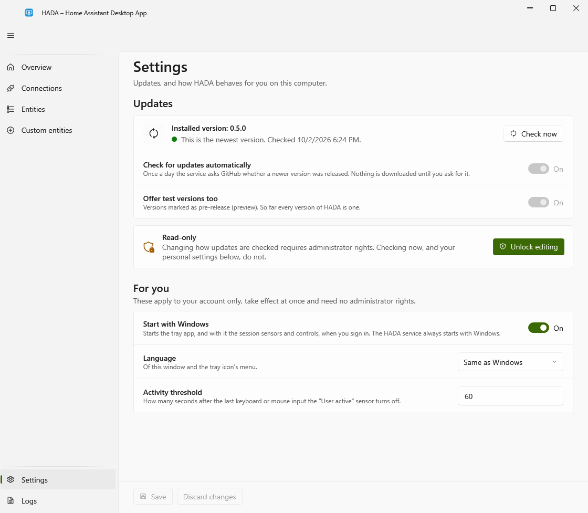

# Updating

Once a day the service asks GitHub whether a newer HADA was released: one request to `api.github.com`, which carries the installed version and nothing else. If there is one, `update_available` turns on and the **Overview** and **Settings** pages show it, with two buttons:

- **What is new** opens the release page in your browser.
- **Download and install** downloads the installer for this computer (x64 or ARM64) to `%LocalAppData%\HADA\updates`, compares it with the checksum published with the release, and starts it. From there it is the ordinary installer: you click through it, and Windows asks for administrator rights. A download that does not match its checksum is deleted and not started.

Nothing is downloaded or installed unless you press that button. It is offered in the window opened from the tray icon, not in the administrator window opened with **Unlock editing**: an installer started from there would run as administrator throughout, and so would the tray app it starts at the end.

On the **Settings** page:

- **Check now** asks GitHub at once and says what it found. Anyone signed in may use it; pressing it again within half a minute repeats the last answer instead of asking again.
- **Check for updates automatically** turns the daily request off or on. **Check now** works either way.
- **Offer test versions too** decides whether versions marked as pre-release count. So far every version of HADA is one, so with this off nothing is offered.

The check sees only what GitHub shows without signing in. While the repository is private there is nothing to compare with; **Check now** says so, and `update_available` stays off.

The checksum protects against a damaged or incomplete download. It is not a signature: it comes from the same place as the installer, so it cannot prove who built it.
