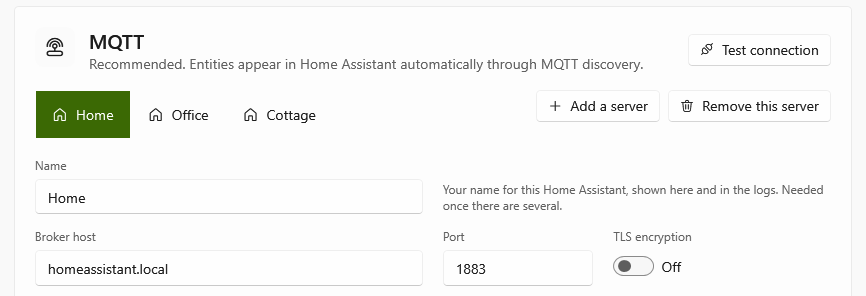

# MQTT engine

The recommended way to connect. HADA announces itself through MQTT discovery, so the computer appears in Home Assistant as a device with all its entities, each with a unique ID, and Home Assistant knows when the computer goes away.


Entities show up automatically under **Settings → Devices & services → MQTT** as a device named after the PC. Buttons, the volume slider and the mute switches can be used from the dashboard or in automations like any other `button`, `number` or `switch` entity:

```yaml
actions:
  - action: number.set_value
    target:
      entity_id: number.laptop_volume_level
    data:
      value: 30
  - action: button.press
    target:
      entity_id: button.laptop_media_play_pause
```

If the service stops or loses its connection, all of the device's entities turn *unavailable*. The tray app's sensors also turn *unavailable* while the tray app is not running, for example when nobody is signed in, so an automation never acts on a value from an hour ago.

## Several Home Assistants at once

*New in 1.2.0.*

A computer can report to more than one Home Assistant at the same time: one at home, one at the office and one in a holiday flat, say, each with automations of its own. Every Home Assistant is one MQTT server on the **Connections** page:



1. Choose **Add a server**, and give each server a name, such as the place it is in. The name is yours: it is shown on the server's tab, on its card on the **Overview** page and in the log. Home Assistant does not see it.
2. Fill in the broker of that Home Assistant, as for the first one, and choose **Test connection**. The test tries the server whose tab is open.
3. **Save**.

HADA is then connected to all of them at once, and each Home Assistant shows the computer as a device of its own, with the same entities. Each can press its buttons and send it notifications; the buttons of a notification answer only the Home Assistant that sent it.

- A server that cannot be reached, the office's while you are at home for instance, is tried again at least once a minute and does not hold the others up. The log says so once, and again only when the reason changes or it worked in between.
- Entities switched off on the **Entities** page are off for every server.
- Each server has its own Device ID and name, both the computer's name when left empty. Two servers on the same broker need different Device IDs, or they throw each other off.
- Removing a server disconnects from it, and its Home Assistant shows the computer's entities as *unavailable*. To remove the device there as well, delete it under **Settings → Devices & services → MQTT**.
- Two servers that are the same Home Assistant show every entity there twice.

## The broker's address

An IP address always works. A name works when Windows can find it:

- A name ending in `.local`, such as `homeassistant.local`, is found by asking the devices on the same network (mDNS). From another network it is not found, and through a VPN such as ZeroTier or Tailscale usually not either: use the IP address there.
- A name often stands for several addresses, `.local` ones especially: one IPv4 address and one or more IPv6 ones, of which the broker may answer on only some. HADA tries the IPv4 ones first, gives each a few seconds, and remembers the one that answered. When the name cannot be found for a moment, it connects to that address.
- The log says what the name stands for and where HADA connected, for instance *The broker's name 'homeassistant.local' stands for 192.168.1.20, fd00:1::20; connecting to 192.168.1.20.* If that is not your broker's address, the name belongs to another device; a router often answers to the name of the network.
- With TLS, the broker's certificate is checked against the name you typed, not against the address it stands for.

## Topics

With `{device}` being the Device ID:

| Topic | Content |
|---|---|
| `homeassistant/{sensor\|binary_sensor\|button\|switch\|number\|notify}/{device}/{entity}/config` | Discovery config (retained; emptied when the entity is disabled or removed) |
| `hada/{device}/availability` | `online` / `offline` (retained, last will) |
| `hada/{device}/{entity}/availability` | `online` / `offline` (retained). `offline` while the entity's source is away, e.g. the tray app's sensors after sign-out |
| `hada/{device}/{entity}/state` | State (retained). Binary sensors and switches report `on` / `off` |
| `hada/{device}/{entity}/attributes` | Sensor attributes as JSON (retained) |
| `homeassistant/device_automation/{device}/{entity}/config` | Discovery config of a [quick action](../features/custom-entities.md#quick-actions) as a trigger of the device (retained; emptied when it is removed) |
| `hada/{device}/event/quick_action` | A quick action was chosen; the payload is its ID. Not retained |
| `hada/{device}/event/notification_action` | A button of a [notification](../features/notifications.md) was pressed; the payload is its `action`. Not retained |
| `hada/{device}/{entity}/set` | Command: `PRESS` for a button, `on` / `off` for a switch, the value for a number, the message (or JSON with `message` and optionally `title`, `image`, `actions` and [more](../features/notifications.md#more-than-a-text)) for `notification`. Anything else is ignored, as are retained commands |
