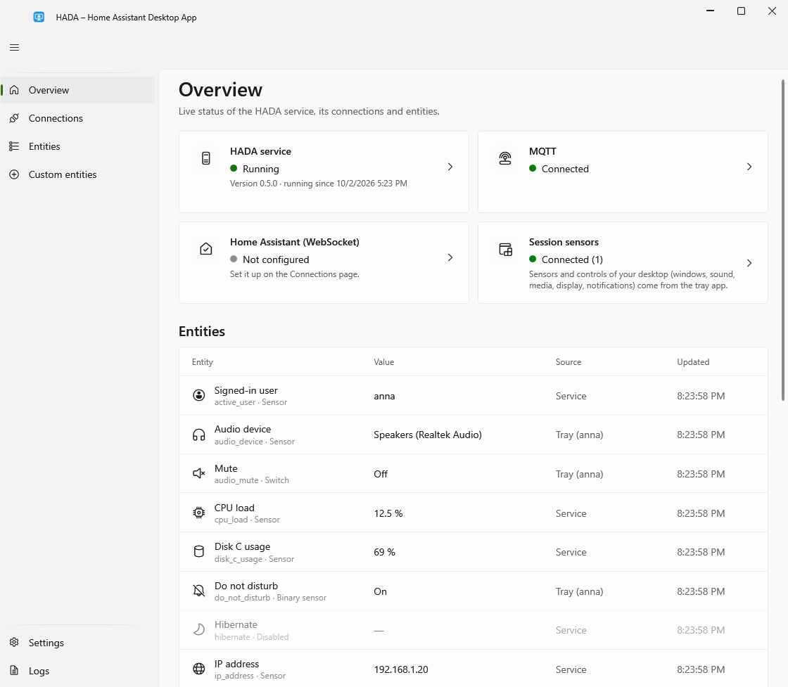

# HADA – Home Assistant Desktop App

HADA łączy komputer z Windows z [Home Assistant](https://www.home-assistant.io/). Działa w tle, przekazuje do Home Assistant, co dzieje się na komputerze, i pozwala nim stamtąd sterować.

!!! note "Tłumaczenie w toku"
    Strony, które nie mają jeszcze polskiej wersji, wyświetlają się po angielsku.

## Co potrafi

- **Zgłasza stan komputera.** Czy ekran jest włączony, sesja zablokowana, ktoś siedzi przy klawiaturze; co jest odtwarzane; czy mikrofon lub kamera są w użyciu; bateria, sieć, dyski i więcej. Zobacz [Czujniki](features/sensors.md).
- **Wykonuje polecenia.** Głośność i wyciszenie, klawisze multimedialne, ekran, blokada, uśpienie i wyłączenie. Zobacz [Sterowanie](features/controls.md).
- **Pokazuje powiadomienia** wysłane z Home Assistant. Zobacz [Powiadomienia](features/notifications.md).
- **Pozwala dodać własne** czujniki i przyciski bez pisania kodu: czy działa program, czy podłączona jest stacja dokująca, wynik polecenia PowerShell, przycisk, który uruchamia program lub naciska klawisze. Zobacz [Własne czujniki i przyciski](features/custom-entities.md).
- **Uruchamia automatyzacje z komputera.** Szybkie akcje w menu ikony w zasobniku, każda z opcjonalnym skrótem klawiszowym, oraz przyciski na powiadomieniach. Zobacz [Szybkie akcje](features/custom-entities.md#quick-actions).
- **Pokazuje Twój dashboard** w małym oknie otwieranym z ikony w zasobniku. Zobacz [Okno dashboardu](window.md#the-dashboard-window).

## Jak jest zbudowana

- **Usługa Windows i mała aplikacja w zasobniku.** Usługa utrzymuje połączenie z Home Assistant i działa także wtedy, gdy nikt nie jest zalogowany. Aplikacja w zasobniku dodaje to, co widać tylko z pulpitu zalogowanego użytkownika.
- **Lekka.** Około 15 MB na usługę i 20–25 MB na aplikację w zasobniku. Okno to osobny proces, który istnieje tylko wtedy, gdy jest otwarte.
- **MQTT discovery.** Komputer pojawia się w Home Assistant jako urządzenie ze wszystkimi encjami; nie trzeba nic pisać w YAML-u. Może raportować do kilku instancji Home Assistant naraz. Działa też bezpośrednie połączenie WebSocket, z [ograniczeniami](home-assistant/websocket.md#limitations).
- **Pod Twoją kontrolą.** Każda encja ma swój przełącznik. Przyciski wyłączające komputer są nieaktywne, dopóki ich nie włączysz. Ustawienia może zmieniać tylko administrator.
- **x64 i ARM64**, Windows 10 (1809 lub nowszy) i Windows 11. Po polsku i po angielsku.

## Zacznij tutaj

1. [Zainstaluj HADA](getting-started/installation.md) albo rozpakuj [wersję przenośną](getting-started/portable.md)
2. [Połącz ją z Home Assistant](getting-started/first-setup.md)
3. Użyj encji w [automatyzacjach](home-assistant/examples.md)

HADA jest darmowa i otwartoźródłowa, na [licencji MIT](https://github.com/inowakowski/home-assistant-desktop-app/blob/main/LICENSE). Wersje stabilne zachowują ustawienia i tematy MQTT między kolejnymi wydaniami; wersje oznaczone jako pre-release zawierają nowe funkcje, które były krócej testowane.
